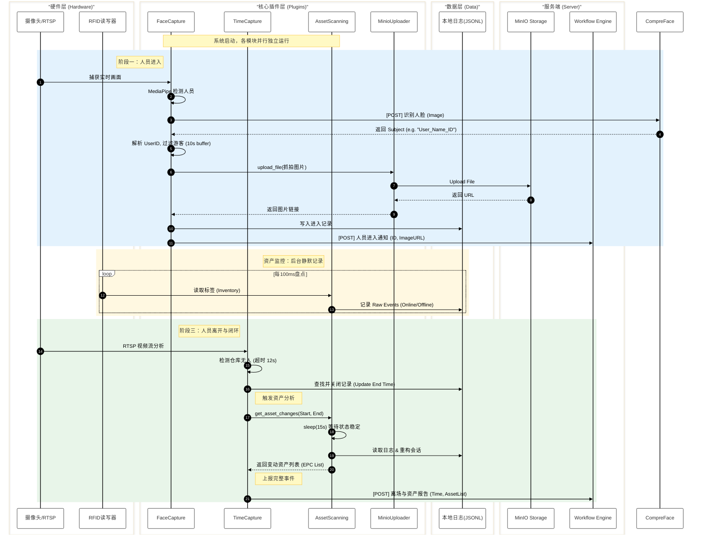

# 仓管系统 (Warehouse Monitoring System)

## 简介 (Introduction)
本项目是一个集成了计算机视觉和物联网技术的仓库智能监控系统。它利用 AI 模型进行人员进出管理，结合 RFID 技术进行资产流动追踪，实现对仓库环境的全方位自动化监控。

系统采用 Docker 容器化部署，包含两个核心服务容器：
1.  **warehouse-system**: 核心业务容器，包含 FaceCapture, AssetScanning, TimeCapture, MinioUploader 以及 Web 管理后台。
2.  **feishu-longconnect**: 独立容器，负责飞书卡片消息的长连接交互。

## 核心功能 (Features)

### 1. 实时人脸检测与抓拍 (FaceCapture)
*   **实时监控**: 调用本地摄像头（Index 0, V4L2 MJPG）进行不间断监控。
*   **智能识别**: 
    *   集成 Google MediaPipe (EfficientDet-Lite0) 模型检测人员。
    *   **直通模式**: 只要检测到人脸即刻触发识别，移除复杂的本地追踪逻辑以提高响应速度。
*   **身份验证**: 
    *   直接对接 **Exadel CompreFace** REST API。
    *   **Subject 解析**: 支持 `类型_姓名_ID` (如 `User_ZhangSan_1001`) 或 `姓名_ID` 格式，自动提取 `UserID` 和 `NickName`。
*   **流量控制 (智能防抖)**: 
    *   **注册用户**: **10分钟冷却 (600s)**。同一用户在10分钟内只会上报一次，避免刷屏。
    *   **游客**: **10秒缓冲期**。若在缓冲期内检测到注册用户，系统会**优先上报用户**并丢弃游客记录；只有缓冲期结束且无用户出现时，才上报游客。
*   **按需上传**: 图片仅在通过冷却检查且确定需要上报时才上传至 MinIO，大幅节省带宽和存储。

### 2. 资产流动追踪 (AssetScanning)
*   **门框模式**: 将 RFID 天线安装在门框处。
*   **严格判定逻辑**: 
    *   **完整穿过**: 资产必须经历 **Online (出现) -> Offline (消失)** 的完整过程才被视为一次有效变动。
    *   **去噪**: 过滤掉只有 Online 没有 Offline（长期停留）或只有 Offline（幽灵数据）的无效记录。
*   **离场触发**: 仅在人员离场（TimeCapture 触发）时，回溯过去一段时间的资产变动并上报。

### 3. 离场监控与事件闭环 (TimeCapture)
*   **全景监控**: 通过 RTSP 协议连接海康威视（Hikvision）摄像头。
*   **离场判定**: 后台线程实时分析视频流，当仓库内持续无人（超时 12s）时判定为离场。
*   **自动闭环**: 触发 AssetScanning 进行资产盘点，并将【离场时间 + 变动资产列表】打包上报。

### 4. 系统管理与日志 (Web Admin)
*   **Web 界面**: 集成在 `warehouse-system` 容器中，端口 `13999`。
*   **实时日志**: 支持查看 System, Asset, Person 各类日志。
*   **日志高亮**: 支持 ANSI 颜色解析，**绿色**代表发送请求，**粉色**代表接收响应，一目了然。
*   **配置管理**: 支持在线修改 `.env` 配置文件并重启生效。

## 系统架构 (Architecture)

```mermaid
graph TD
    subgraph Docker_Host [🐳 Docker Host]
        direction TB
        
        subgraph Container_System [📦 warehouse-system]
            Face[� FaceCapture<br/>(MediaPipe + CompreFace)]
            Asset[� AssetScanning<br/>(RFID C++ SDK)]
            Time[� TimeCapture<br/>(RTSP + MediaPipe)]
            Web[🖥️ Web Admin<br/>(FastAPI :13999)]
            MinioUp[☁️ MinioUploader<br/>(Rate Limit: 1s)]
            
            Face --> MinioUp
            Face --> Web
            Asset --> Web
            Time --> Asset
        end

        subgraph Container_Feishu [📦 feishu-longconnect]
            Feishu[🦅 Feishu Bot<br/>(WebSocket)]
        end
    end

    subgraph External_Devices [🔌 External Devices]
        Cam[📷 USB Camera]
        RTSP[📹 Hikvision RTSP]
        RFID_HW[📟 RFID Reader<br/>(/dev/ttyACM*)]
    end

    subgraph Cloud_Services [☁️ Cloud Services]
        CompreFace[🧠 CompreFace Server]
        MinIO[🗄️ MinIO Storage]
        Workflow[⚙️ Backend Workflow]
        FeishuAPI[🦅 Feishu Open Platform]
    end

    Cam ==> Face
    RTSP ==> Time
    RFID_HW ==> Asset
    
    Face -- "Recognize" --> CompreFace
    MinioUp -- "Upload" --> MinIO
    Face -- "Report" --> Workflow
    Time -- "Report" --> Workflow
    Feishu <-- "WS" --> FeishuAPI
    Feishu -- "Execute" --> Workflow
```

### 核心流程时序图 (Sequence Diagram)
以下时序图展示了 **FaceCapture** (入口)、**AssetScanning** (资产) 和 **TimeCapture** (出口) 三大模块的协同工作流程。



## 快速开始 (Quick Start)

### 1. 环境准备
*   操作系统: Linux (推荐 Ubuntu 22.04+)
*   Docker & Docker Compose
*   硬件设备连接确认:
    *   USB 摄像头 -> `/dev/video0`
    *   RFID 读写器 -> `/dev/ttyACM*`

### 2. 配置 (.env)
复制 `.env.example` (如果有) 或直接创建 `.env` 文件：

```properties
# === 基础配置 ===
RTSP_URL_TIMECAPTURE=rtsp://user:pass@ip:port/...
AGENT_BASE_URL=http://...
AGENT_WORKFLOW_ID=...
AGENT_API_KEY=...

# === 人脸识别 (CompreFace) ===
FACE_API_URL=http://192.168.x.x:8000/api/v1/recognition/recognize
FACE_API_KEY=your-uuid-key
# 冷却时间 (秒)
FACE_COOLDOWN_DURATION=600.0
# 游客缓冲 (秒)
FACE_VISITOR_BUFFER_DURATION=10.0

# === 对象存储 (MinIO) ===
MINIO_UPLOAD_URL=http://...

# === RFID ===
RFID_CONN_STR=/dev/ttyACM0
RFID_LIB_PATH=./lib/libModuleAPI.so
```

### 3. 启动系统
使用 Docker Compose 一键启动所有服务：

```bash
# 构建镜像
sudo docker compose build

# 启动服务 (后台运行)
sudo docker compose up -d

# 查看日志
sudo docker compose logs -f
```

### 4. 访问管理后台
启动成功后，浏览器访问：`http://<服务器IP>:13999`
*   查看实时运行日志
*   调整系统参数

## 目录结构 (Directory Structure)
```
warehouse/
├── docker-compose.yml          # 容器编排文件
├── Dockerfile.warehouse        # 主系统镜像构建文件
├── Dockerfile.feishu           # 飞书服务镜像构建文件
├── .env                        # 系统配置文件
├── lib/                        # RFID 动态库 (libModuleAPI.so)
├── src/
│   ├── main.py                 # 主程序入口 (System)
│   ├── web_admin.py            # Web 管理后台入口
│   ├── config.py               # 配置加载器
│   ├── static/                 # Web 前端资源 (index.html)
│   ├── plugins/                # 核心功能插件
│   │   ├── FaceCapture.py      # 人脸识别 (CompreFace)
│   │   ├── AssetScanning.py    # 资产追踪 (RFID)
│   │   ├── TimeCapture.py      # 离场监控
│   │   ├── MinioUploader.py    # 图片上传 (含限流)
│   │   └── ToAgent.py          # 后端通信
│   └── models/                 # MediaPipe 模型文件
└── requirements.txt            # Python 依赖
```

## 注意事项
1.  **USB 权限**: `docker-compose.yml` 中开启了 `privileged: true` 以确保容器能访问 USB 摄像头和串口设备。
2.  **网络模式**: 使用 `network_mode: host` 是为了确保 RTSP 视频流的稳定性和简化端口映射。
3.  **日志颜色**: Web 端日志查看器支持 ANSI 颜色代码，若在其他工具查看乱码，请使用支持 ANSI 的终端或 `less -R`。
