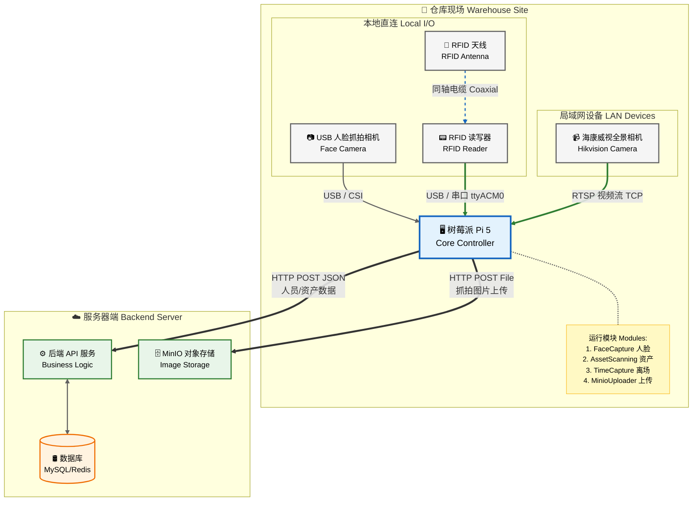
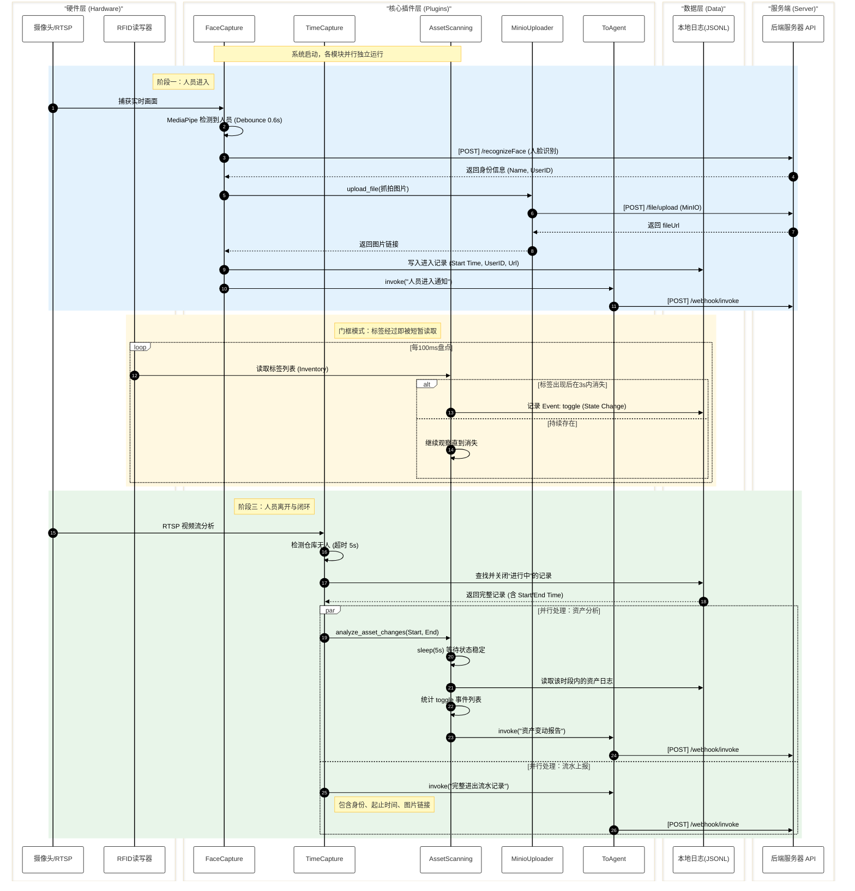

# 仓管系统 (Warehouse Monitoring System)

## 简介 (Introduction)
本项目是一个集成了计算机视觉和物联网技术的仓库智能监控系统。它利用 AI 模型进行人员进出管理，结合 RFID 技术进行资产流动追踪，实现对仓库环境的全方位自动化监控。

系统核心包含四大模块：
1.  **FaceCapture**: 基于 MediaPipe 的实时人脸检测与身份识别（入口）。
2.  **AssetScanning**: 基于 RFID 的资产实时盘点与变动追踪。
3.  **TimeCapture**: 基于 MediaPipe 与 RTSP 视频流的人员离场判定与事件闭环（出口）。
4.  **MinioUploader**: 基于 MinIO 的抓拍图片自动上传服务。

## 核心功能 (Features)

### 1. 实时人脸检测与抓拍 (FaceCapture)
*   **实时监控**: 调用本地摄像头（Index 0）进行不间断监控。
*   **智能识别**: 集成 Google MediaPipe (EfficientDet-Lite0) 模型检测人员，支持防误触（Debounce 0.6s）与距离过滤。
*   **身份验证**: 对接后端人脸识别接口，确认人员身份。
*   **流量控制**: 智能冷却机制，游客冷却 1s，普通人员冷却 5s；支持状态校验，避免重复记录未离场人员。
*   **实时上报**: 人员进入时立即通知服务器，并附带抓拍图片链接。

### 2. 资产流动追踪 (AssetScanning)
*   **门框模式**: 将 RFID 天线安装在门框处，标签经过时短暂被读取。
*   **切换判定**: 检测到“短暂上线→下线”即判定为一次**状态变动 (Toggle)**。
    *   不再区分入库/出库，统一上报变动事件。
    *   由服务器端根据历史状态判断具体的出入方向。
*   **变动分析**: 在人员离场后，自动分析该时段内的资产变动情况。
*   **数据同步**: 生成资产变动报告并上报服务器。

### 3. 离场监控与事件闭环 (TimeCapture)
*   **全景监控**: 通过 RTSP 协议连接海康威视（Hikvision）摄像头。
*   **离场判定**: 后台线程实时分析视频流，当仓库内无人（超时）时判定为离场。
*   **自动闭环**: 计算停留时长，触发资产变动分析，并将完整记录（人员+时间+资产）上报系统。

## 系统架构与流程 (Architecture & Workflow)

### 1. 系统部署拓扑图
以下拓扑图展示了系统的物理部署架构、硬件连接方式以及网络通信链路。



### 2. 核心流程时序图
以下时序图展示了 **FaceCapture** (入口)、**AssetScanning** (资产) 和 **TimeCapture** (出口) 三大模块的协同工作流程。



## 环境要求 (Requirements)
*   Python 3.8+
*   Python 依赖以 `requirements.txt` 为准；运行视觉模块还需 `mediapipe`、`opencv-python`、`numpy`。
*   硬件：
    *   树莓派 Pi 5 或更高性能工控机（Ubuntu24.04）。
    *   USB/CSI 摄像头（用于人脸抓拍）。
    *   海康威视网络摄像头（用于全景监控）。
    *   串口 RFID 读写器（支持 moduleAPI）。

## 辅助工具 (Helper Scripts)
*   `origin_scripts/feishu_longconnect.py`: 飞书长链接示例。
*   `origin_scripts/feishu_img2path.py`: 飞书图片上传与路径转换示例。
*   `origin_scripts/send_test_card.py`: 飞书卡片消息测试脚本。
*   `origin_scripts/vedio_backup.py`: 录像备份脚本参考。

## 快速开始 (Quick Start)

### 1. 安装依赖
```bash
# 1. 安装系统级依赖
sudo apt update && sudo apt install -y python3-pip python3-opencv

# 2. 安装 Python 依赖
pip install -r requirements.txt --break-system-packages
python3 -m pip install mediapipe opencv-python numpy --break-system-packages
```

### 2. 配置环境
编辑项目根目录 `.env`，至少配置以下关键项：

```
RTSP_URL_TIMECAPTURE=
FACE_API_URL=
AGENT_BASE_URL=
EMPLOYEE_ID=
USER_ID=
MINIO_UPLOAD_URL=
RFID_CONN_STR=
```

可选项：
```
RTSP_URL_BACKUP_BASE=
FACE_CONFIDENCE_THRESHOLD=
FACE_MIN_DETECTION_DURATION=
TIME_CONFIDENCE_THRESHOLD=
TIME_PERSON_TIMEOUT=
RFID_LIB_PATH=
HEADLESS=
```

### 3. 运行系统
```bash
# 必须在项目根目录下运行
python src/main.py
```

### 4. 运行模式
启动后，系统将自动加载以下服务：
*   **AssetScanning**: 后台线程，持续盘点 RFID 标签。
*   **TimeCapture**: 后台线程，监控 RTSP 视频流。
*   **FaceCapture**: 主线程（前台），显示实时监控窗口（按 `q` 或 `Ctrl+C` 退出）。

## 目录结构 (Directory Structure)
```
warehouse/
├── lib/                        # RFID 动态库 (libModuleAPI.so)
├── origin_scripts/             # 历史/参考脚本
├── src/
│   ├── models/                 # MediaPipe 模型目录
│   ├── main.py                 # 主程序入口，负责服务编排
│   ├── plugins/                # 功能插件模块
│   │   ├── FaceCapture.py      # 入口人脸抓拍模块
│   │   ├── TimeCapture.py      # 出口离场监控模块
│   │   ├── AssetScanning.py    # RFID 资产追踪模块
│   │   ├── ToAgent.py          # 后端通信接口
│   │   └── MinioUploader.py    # MinIO 文件上传模块
│   └── config.py               # 配置与日志初始化
├── doc/                        # 项目文档
│   ├── design.md               # 详细流程与逻辑说明
│   └── RFID_mainfunc.md        # RFID 动态库说明
└── requirements.txt            # 项目依赖
```

## 配置说明 (Configuration)
主要配置统一由 `src/config.py` 从 `.env` 载入并提供给各插件：

*   **FaceCapture**: `FACE_API_URL`、`FACE_CONFIDENCE_THRESHOLD`、`FACE_MIN_DETECTION_DURATION`、`HEADLESS`。
*   **TimeCapture**: `RTSP_URL_TIMECAPTURE`、`TIME_CONFIDENCE_THRESHOLD`、`TIME_PERSON_TIMEOUT`。
*   **AssetScanning**: `RFID_CONN_STR`、`RFID_LIB_PATH`。
*   **MinioUploader**: `MINIO_UPLOAD_URL`。
*   **ToAgent**: `AGENT_BASE_URL`、`EMPLOYEE_ID`、`USER_ID`。

## 贡献者名单 (Contributors)
[](https://github.com/BorderArea01/warehouse/graphs/contributors)
